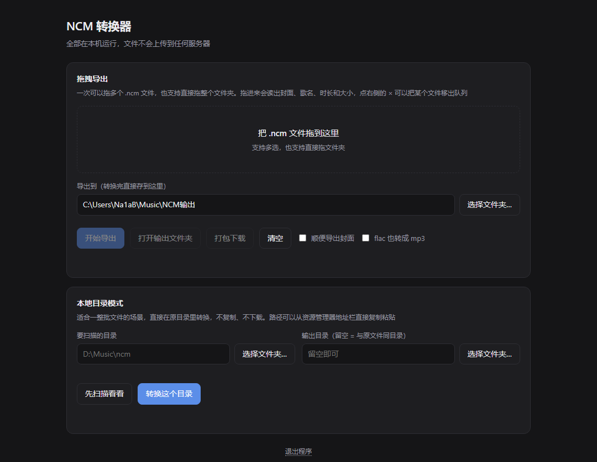

# NCM 转 MP3

> 网易云音乐 `.ncm` 加密缓存文件的解密 / 提取工具 —— 零第三方依赖，带本地网页控制台，打包成单文件 exe 即可在任意 Windows 电脑上双击使用。

把一个（或一整个文件夹的）`.ncm` 拖进去，拿回干净的 `MP3` / `FLAC`、完整的歌曲信息和专辑封面。全程本地运算，文件不出本机。

- **纯标准库**：手写 AES-128-ECB 与 RC4 变种，运行时不依赖任何 pip 包
- **单文件免安装**：打包后 8.4 MB 一个 exe，目标电脑不需要装 Python
- **图形界面 + 命令行双模**：拖拽批量转换，或 `-j 8` 多进程跑脚本
- **开箱即用**：NCM 本来就是容器不是编码，解封装后直接得到原始音频，不做二次转码



---

## 目录

- [这是什么](#这是什么)
- [快速开始](#快速开始)
- [命令行用法](#命令行用法)
- [从源码构建](#从源码构建)
- [常见问题](#常见问题)
- [合规声明](#合规声明)

---

## 这是什么

网易云音乐客户端下载的缓存文件使用自家 `.ncm` 加密格式：音频流被一层流密码加密，同时把封面图和歌曲元数据（歌名 / 歌手 / 专辑）一起封装在文件头里。这个格式只能被客户端自己播放，拷到 MP3 播放器、车机或者剪辑软件里都用不了。

本工具做三件事：

1. **解封装** —— 读文件头，把内嵌的封面和元数据完整取出来
2. **还原音频** —— 解密音频流，按魔术字节自动识别真实格式（通常是 `mp3`，也可能是 `flac`）
3. **整理落盘** —— 按 `歌名 - 歌手` 命名输出（扩展名与源音频一致，即 `.mp3` 或 `.flac`），可选同时导出封面 JPEG / PNG

它**不破解、也不绕过任何付费或会员校验**，只处理你已经合法下载到本地的文件。详见 [合规声明](#合规声明)。

---

## 快速开始

### 方式一：直接用 exe（推荐）

到 [Releases](../../releases) 下载：

| 文件 | 说明 |
|---|---|
| `NCM转MP3.exe` | **双击即用**，自动打开图形界面（无控制台黑框） |
| `ncm2mp3-命令行.exe` | 命令行版；也可以把 `.ncm` 文件直接拖到图标上 |

免安装、免配置、不依赖 Python。要求 **64 位 Windows 10 / 11**。

### 方式二：从源码运行

只需要 Python 3.8+，**不需要安装任何第三方包**：

```bash
python ncm2mp3.py                 # 打开图形界面
python ncm2mp3.py D:\Music\ncm    # 直接转换整个目录
```


---

## 命令行用法

```bash
python ncm2mp3.py [文件或目录 ...] [选项]
```

| 参数 | 说明 |
|---|---|
| `paths` | 一个或多个 `.ncm` 文件／目录（目录会递归） |
| `-o, --out DIR` | 输出目录，默认与原文件同目录 |
| `-j, --jobs N` | 并行进程数，默认 1（多核批量建议 4~8） |
| `--cover` | 同时导出专辑封面为 `.jpg` / `.png` |
| `--to-mp3` | 源是 flac 等非 mp3 格式时，用 ffmpeg 转成 mp3 |
| `--here` | 转换当前目录（等价于传入 `.`） |
| `--gui` | 显式打开图形界面 |
| `--port N` | 界面端口，默认自动分配空闲端口 |
| `--out-dir DIR` | 界面上「导出到」的初始目录 |
| `--no-browser` | 打开界面但不自动拉起浏览器 |
| `--no-app` | 强制用普通浏览器标签页（不用应用窗口模式） |

使用示例：

```bash
# 递归转换整个目录，输出到同目录
python ncm2mp3.py D:\Music\ncm

# 指定输出目录，8 进程并行，同时导出封面
python ncm2mp3.py D:\Music\ncm -o D:\out -j 8 --cover

# 命令行模式转换当前目录
python ncm2mp3.py --here

# 源是 flac 也强制转成 mp3（需要系统里有 ffmpeg）
python ncm2mp3.py D:\Music\ncm --to-mp3
```

输出命名规则：优先 `歌名 - 歌手`，其次文件名兜底；自动清洗 Windows 非法字符（`\ / : * ? " < > |`）；重名自动编号。

---


## 从源码构建

```bash
pip install pyinstaller
python build_exe.py
```

产物在 `dist/`：

| 文件 | 说明 |
|---|---|
| `dist/NCM转MP3.exe` | 图形界面版（`--onefile --windowed`，无控制台窗口） |
| `dist/ncm2mp3-命令行.exe` | 命令行版，支持拖文件到图标上 |

构建脚本会自动带上 `ncm2mp3.ico` 图标。单个 exe **完全自包含**，拷到任何 64 位 Windows 上都能直接跑（已实测：把 exe 单独放进一个空目录，转换 4 个真实文件全部成功，中文文件名正常，同目录不产生任何附加文件）。

**唯一的两处外部依赖**（都不在 exe 内，缺失也不会崩）：

1. **Edge 或 Chrome** —— 图形界面靠系统浏览器承载。Windows 10/11 自带 Edge，实际不构成障碍；找不到时会退回默认浏览器，或改用命令行模式
2. **ffmpeg** —— **仅当源是无损 FLAC、且你要求把它转成 MP3 时才需要**（`--to-mp3` 或界面勾选「flac 也转成 mp3」）。缺失时代码会提示 `winget install Gyan.FFmpeg`，其它功能不受影响

---

## 常见问题

**Q：会覆盖我原来的文件吗？**
不会。输出目录里若有同名文件，会自动加序号（`X (2).mp3`）另存。

**Q：需要联网吗？会偷偷上传文件吗？**
不需要联网，也不上传任何数据。图形界面只监听 `127.0.0.1`，且每次都生成一次性随机访问令牌。

**Q：转出来的到底是不是 MP3？为什么有时会变成 FLAC？**

NCM 只是一个「封装盒」，解密后取出的是**原封不动的原始音频**，所以输出格式取决于你当初下载的音质档位 —— **和在哪台电脑上运行没有任何关系**：

| 你下载的档位 | 盒子里装的是 | 输出 | 需要 ffmpeg 吗 |
|---|---|---|---|
| 标准 / 较高 / 极高音质 | MP3 | `.mp3` | **不需要** |
| 无损 SQ / Hi-Res | FLAC | `.flac`（保留无损） | 不需要 |

**绝大多数情况（有损音质）解出来本来就是 MP3**，双击转完即可，把 exe 拷到任何 Windows 电脑上结果都一样。

只有当你下载的是**无损**、又确实想要 MP3 时才需要转码：命令行加 `--to-mp3`，或界面里勾选「flac 也转成 mp3」。这一步要调用 **ffmpeg**，而 ffmpeg **不在 exe 里**（体积原因，外置探测），所以那台电脑需要先装 `winget install Gyan.FFmpeg`；没装时程序会明确报出「源格式是 flac，强制转 mp3 需要 ffmpeg（未找到）」，不会静默失败。

⚠️ 另外提醒：flac → mp3 是**有损压缩**，会把无损降级，除非播放设备不支持 flac，否则没必要转。

**Q：Windows 提示"未知发布者"或杀软报警？**
exe 未做代码签名，且 `--onefile` 是自解压结构，容易被启发式引擎误判。选择「更多信息 → 仍要运行」即可；不放心的话可以直接跑源码，或用 `build_exe.py` 自己构建一份。

**Q：能在外星电脑上用吗（没装 Python）？**
能。exe 是纯单文件的，要求只有 **x64 Windows**。代价是每次启动要自解压约 8.4 MB，首次启动约 1 秒。

**Q：支持 macOS / Linux 吗？**
No，目前只支持Windows。

---


## 合规声明

- 本工具**只解决格式转换 / 解封装**，**不绕过任何付费、会员或版权校验**，也不提供任何音乐下载能力。它无法把没下载过的歌曲变成可下载的。
- 请**仅用于转换你自己已合法获取的音频文件**（例如已开通会员并下载到本地、用于个人设备播放）。请勿用于传播、二次分发或任何商业用途。
- 使用者应自行确保其使用行为符合当地法律法规及平台服务条款。作者不对任何滥用行为负责。

---

## 目录结构

```
.
├── ncm2mp3.py       # 主程序：解密核心 + 命令行 + 本地网页控制台
├── build_exe.py     # 一键打包脚本（PyInstaller，自动带图标）
├── ncm2mp3.ico      # 图标（7 个尺寸）
├── README.md
└── LICENSE          # MIT 许可证全文
```

> 后续版本已把 NCM 解密核心抽象成插件，并入一个更通用的「格式转换工作台」（图片 / PDF / 音视频多格式），本仓库保留 v1.0 的单文件形态，作为最轻量、零依赖的版本。

## 致谢

格式解析过程中对照验证了开源实现 [`taurusxin/ncmdump`](https://github.com/taurusxin/ncmdump) 的字段处理方式（尤其是 AES 块尾部填充的剥离），在此致谢。

## License

本项目基于 [MIT 许可证](LICENSE) 发布 —— 可自由使用、修改、分发，包括商业用途，只需保留版权声明（`Copyright (c) 2026 Na1aB`）。

软件按「原样」提供，不附带任何形式的担保。该许可证只授权**代码本身**的使用，**不构成**对解密他人版权内容的授权 —— 使用边界见上方[合规声明](#合规声明)。
